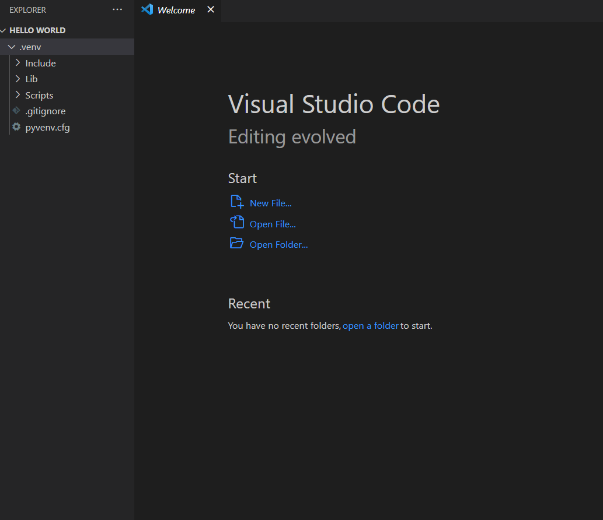
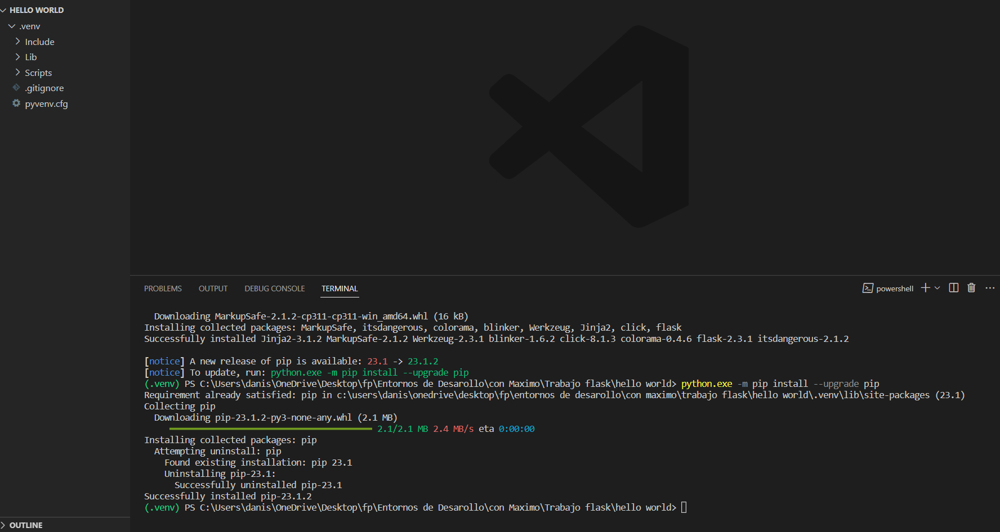
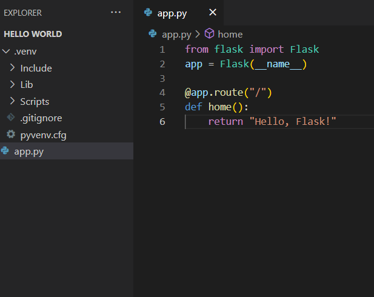

# TrabajoEntornosFlask
---
Mediante la paleta de comando creamos nuestro entorno en el cual podremos usar Flask al cual llamamos Hello_flask

---

Mediante la terminal de los comando instalamos python mediante el comando python.exe -m pip install y para tener las ultimas versines ponemos --upgrade pip 

---

Creamos un archivo de python donde importaremos Flask y le daremos una ruta y alli nos imprima Hello, Flask!

---

Iniciamos el codigo anterior y vemos como en la ruta dicha tenemos el siguiente mensaje

---

